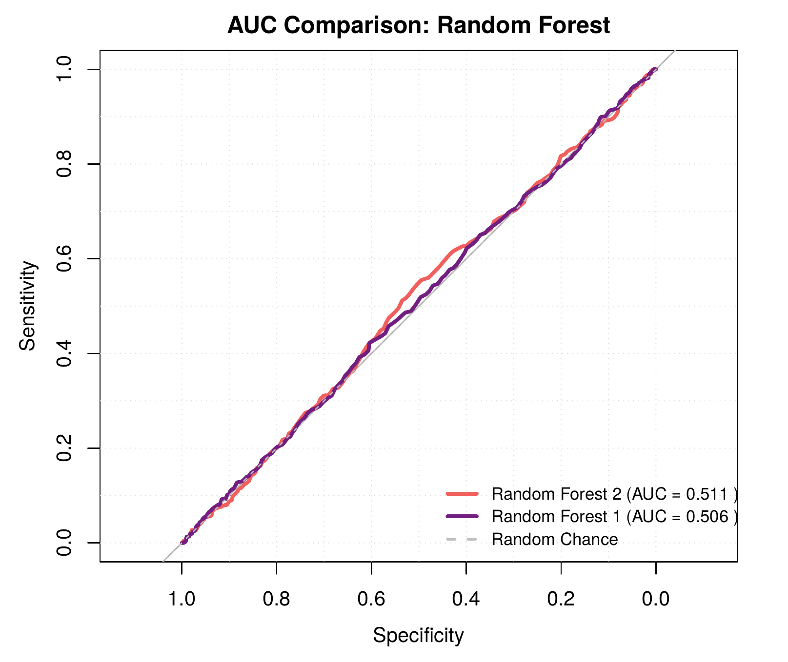
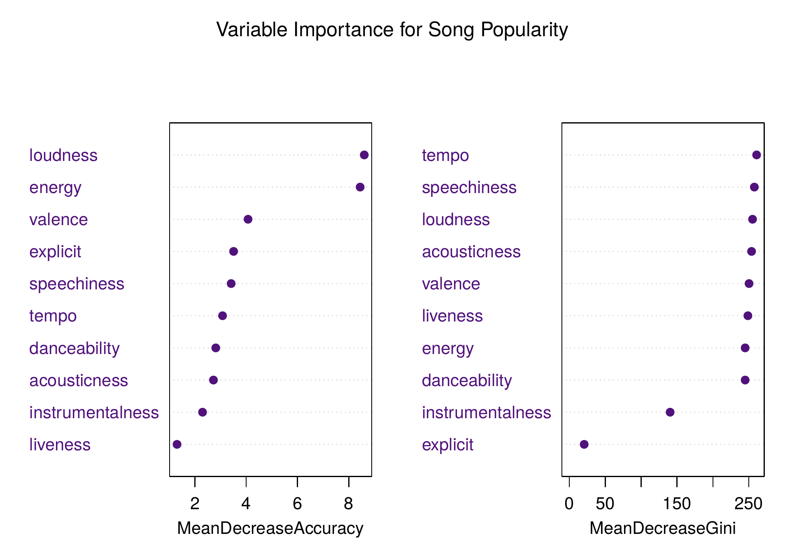
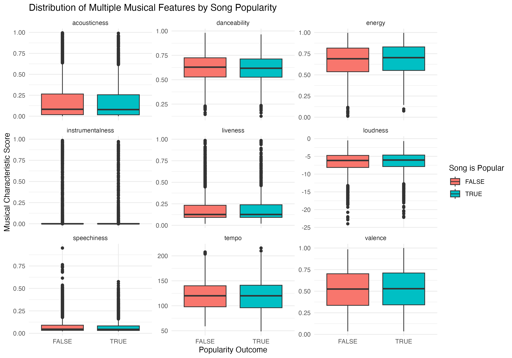
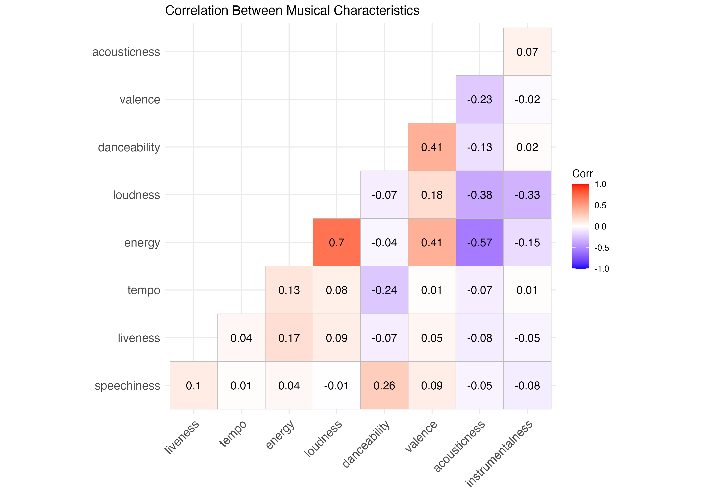

# Predicting Song Popularity from Musical Composition Features: A Dual-Model Approach

Undergraduate/MSc coursework project (University of Sheffield). Tests whether 9 acoustic features plus explicitness can predict whether a song is popular, using two model families (logistic regression and Random Forest), each run with and without the explicitness variable, plus a stepwise-reduced logistic regression.

> **Reproducibility note:** the raw dataset (merged Spotify-style track, artist, and popularity files) is not included in this repo, so `song_pop_code.Rmd` cannot be rerun end-to-end from this repo alone. All headline numbers below were traced to specific lines of the code and cross-checked against the coursework's own results tables rather than taken from the write-up's prose; see the Verification note for exactly what that involved, including two real bugs found in the original code.

## Key results

Five models were fit in total: two logistic regressions (with and without `explicit`), a stepwise-reduced version of the better logistic regression, and two Random Forests (with and without `explicit`).

| Model | Accuracy | Specificity | Sensitivity | AUC |
|---|---|---|---|---|
| Logistic Regression 1 (no explicit) | 63.08% | 100% | 0% | 0.514 |
| Logistic Regression 2 (+ explicit) | 62.58% | 100% | 0% | 0.525 |
| Stepwise Regression (SWR)* | 62.58%† | 100%† | 0%† | 0.524 |
| Random Forest 1 (no explicit)* | 59.63% | 91.67% | **9.03%** | 0.506 |
| Random Forest 2 (+ explicit) | 58.93% | 91.26% | 7.87% | 0.511 |

\* Marked as the best-performing model of its type in the coursework's own results tables.
† These three figures for SWR are very likely inaccurate: see Verification note below. Only SWR's AUC (0.524) was independently confirmed by its own ROC computation.

**The counterintuitive finding the coursework is built around:** Random Forest 2 has a *higher* AUC than Random Forest 1 (0.511 vs. 0.506), but *lower* sensitivity (7.87% vs. 9.03%). Since the whole point of a popularity classifier is catching popular songs, and sensitivity is what measures that, RF1 (not RF2) is the better model despite its lower AUC. Both logistic regressions and the stepwise model scored exactly 0% sensitivity: they never predicted a single song as popular, so their "specificity" and "accuracy" numbers are artifacts of always guessing the majority class, not evidence the models found anything.



**Feature importance (Random Forest, explicit-inclusive model):** loudness and energy were the strongest predictors by Mean Decrease Accuracy; tempo and speechiness by Mean Decrease Gini. Note this chart is only available for Random Forest 2, since the underlying code never generated a separate importance plot for Random Forest 1.



**Musical features by popularity outcome:** across all 9 acoustic features, the boxplots for popular vs. non-popular songs overlap almost completely, visually consistent with the near-chance AUC values above.



**Multicollinearity check:** energy and loudness are correlated at r = 0.7 (the strongest pairwise correlation among the 9 features), consistent with the "loudness war" literature cited in the write-up. All other pairs are weak.



## Methods & tools

- **Language:** R (R Markdown)
- **Data split:** 70/30 train/test, shuffled with a fixed seed
- **Models:** logistic regression (`glm`, binomial), bidirectional stepwise selection (`step`), Random Forest (`randomForest`, 500 trees, permutation-based importance)
- **Evaluation:** confusion matrix (accuracy, sensitivity, specificity), AUC-ROC (chosen over raw accuracy because the outcome classes are imbalanced, 62% not-popular vs. 38% popular), Nagelkerke pseudo-R²
- **Other checks:** Pearson correlation matrix and VIF for multicollinearity; chi-squared test for the association between explicitness and popularity

## Repo structure

```
02-song-popularity-dual-model/
├── README.md                                    ← you are here
├── song_popularity_results_and_conclusions.pdf  ← Results, Discussion and Conclusions sections only (not the full write-up)
├── song_pop_code.Rmd                                  ← full analysis code
└── figures/
    ├── rf1_vs_rf2_auc_comparison.png
    ├── rf2_feature_importance.png
    ├── rf1_auc_curve.png
    ├── stepwise_roc_curve.png
    ├── musical_features_by_popularity.png
    ├── correlation_heatmap.png
    └── extra/
        ├── lgr1_roc_curve.png
        ├── lgr2_roc_curve.png
        ├── rf2_auc_curve.png
        ├── lgr2_vs_rf2_auc_comparison.png
        ├── confusion_matrix_lgr2.png
        ├── confusion_matrix_rf2.png
        ├── confusion_matrix_comparison_lgr2_vs_rf2.png
        ├── lgr2_feature_importance_zscore.png
        ├── rf2_feature_importance_gini_single_panel.png
        └── correlation_heatmap_viridis_alt.png
```

## How to run

1. Install R and the packages `song_pop_code.Rmd` loads at the top (tidyverse, caret, pROC, randomForest, viridis, patchwork, DescTools, car, sjPlot).
2. The script expects several pre-cleaned source files (song, artist, musical-feature, and popularity data) that are not included in this repo; see Data, below.
3. Run top to bottom. A fixed seed is set before each train/test split and each model fit.

## Data

The underlying track/artist/popularity dataset is not redistributed here (Spotify-derived data, not the coursework author's to redistribute). `song_pop_code.Rmd` is included in full so the methodology is auditable even though it can't be rerun without the source files.

## Limitations

- Every model's AUC sits close to 0.5 (random chance); the coursework's own conclusion is that acoustic features have little to no predictive power for popularity on their own, not that one model "solved" the problem.
- Both full logistic regressions and the stepwise model scored 0% sensitivity: they classified every single test-set song as not-popular. Their accuracy and specificity numbers reflect the class balance (62% not-popular), not genuine predictive skill.
- No figure in the original materials directly and correctly shows "Stepwise Regression vs. Random Forest 1" (the coursework's own two best-of-type models) side by side with accurate labels; see Verification note for why, and the table above for the numbers instead.
- Random Forest 1 (the officially best-performing RF model) never got its own feature-importance plot in the code; the only importance chart available is for Random Forest 2.

## Verification note

This project's source code and write-up contained two genuine bugs, found by tracing every number back to the line that produced it rather than trusting the write-up's prose or a plausible-looking chart title.

**Bug 1: the Stepwise Regression's confusion matrix is very likely a duplicate of Logistic Regression 2's.** The code that builds the stepwise model's predicted classes does this:
```r
test_probabilities_swr <- predict(stepwise_model, ...)              # correctly computed...
test_predictions_scores_swr <- ifelse(test_probabilities_2 > 0.5, ...)  # ...but never used: this reuses LGR2's probabilities instead
```
The coursework's own results table (SWR: 62.58% accuracy, 100% specificity, 0% sensitivity) is identical to Logistic Regression 2's, which is consistent with this bug rather than an independent result. Only SWR's AUC (0.524) was computed via a separate, correct path (`roc_stepwise`) and can be trusted.

**Bug 2: the original code's final "best vs. best" comparison chart plots the right model but labels it wrong.** A block titled `"Model Comparison: (Stepwise) Logistic Regression vs. Random Forest"` plots `random_forest_roc_obj` (Random Forest 1's actual ROC data, AUC 0.506, which matches the coursework's own asterisked "best" RF model) but its legend text calls it **"Random Forest 2."** A different, separately-supplied version of this same chunk fixes the label by instead plotting Random Forest 2's data, which makes the chart internally consistent but compares against the RF model the coursework's own tables call the worse one. Per the decision made when rebuilding this repo, the number reported above for the final comparison uses Random Forest 1 (matching the coursework's own stated conclusion), with the original mislabeling corrected rather than carried forward.

Everything else (the individual model metrics in the headline table, the RF1-vs-RF2 AUC chart, the feature importance chart, the correlation and boxplot figures) was traced directly to the code that produced it and matched.
